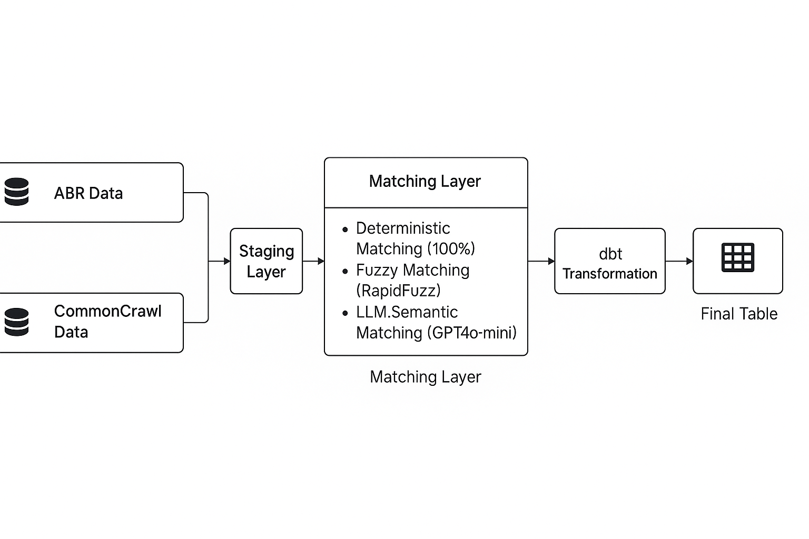
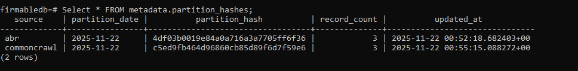
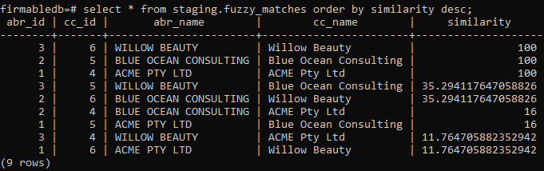
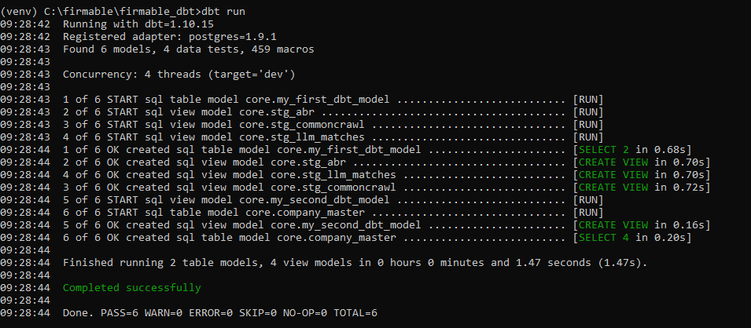
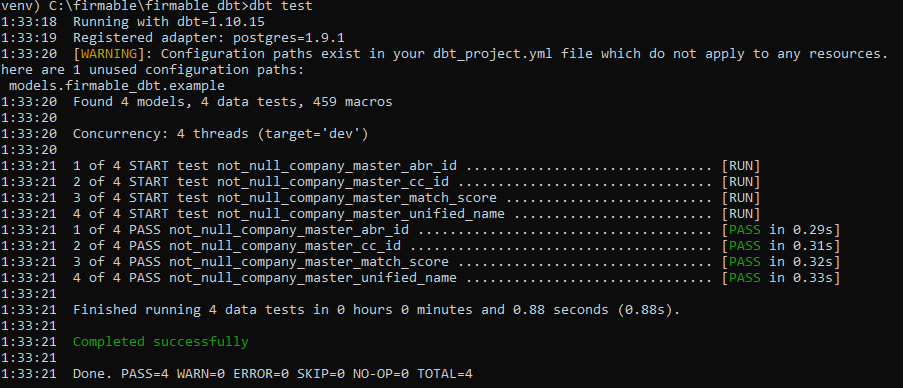
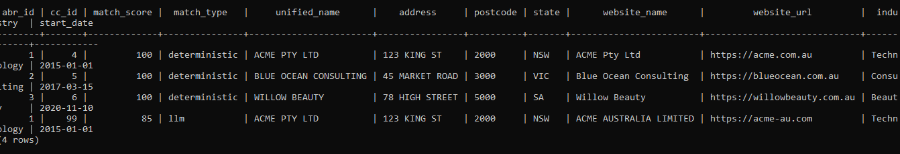

# Firmable Data Pipeline — Technical Assessment

**Author:** Shanthi Sandesh
**Role:** Data Engineer (Assessment)  
**Repo:** Firmable Data Pipeline (Common Crawl + ABR)

---

## Summary
This project implements an end-to-end data pipeline that processes Australian company data from:
- **ABR Bulk XML Extracts**
- **Common Crawl WET dataset**

The pipeline covers:
	•	Extracts and normalizes raw data
	•	Loads everything into PostgreSQL (via Docker)
	•	Performs deterministic, fuzzy, and LLM-assisted entity matching
	•	Builds final models using dbt
	•	Runs data quality validation (ABN checksum + dbt tests)
	•	Provides a unified Company Master Table

---
## 🏗 Architecture Diagram

---

## 📁 Repository Structure
/data/                     # Sample XML, WET, JSONL outputs
/ddl/                      # Database schema
/docs/                     # Architecture + screenshots
/etl/                      # Python extractors & matching scripts
/firmable_dbt/             # dbt models & tests
docker-compose.yml
requirements.txt
README.md

## Quick stats (sample run)

| Stage | Count |
|-------|-------|
| ABR records extracted | 3 |
| CommonCrawl records extracted | 3 |
| Deterministic matches | 3 |
| Fuzzy matches above threshold | 3 |
| LLM-assisted matches | 1 |
| Final unified companies | 4 |

---

# 1️⃣ Data Extraction

## ABR XML → JSONL

Script: `etl/extract_abr.py`  
Features:
- XML parsing  
- Required field extraction  
- Implements **ABN checksum validation**  
- Normalization  
- JSONL output  

Run:
python etl/extract_abr.py data/sample_abr.xml.gz data/abr_output.jsonl

---

## Common Crawl WET → JSONL

Script: `etl/extract_commoncrawl.py`  
Features:
- Parses WET records  
- Filters `.au` domains  
- Extracts URL, company name, industry  

Run: 
python etl/extract_commoncrawl.py data/sample_cc.wet data/cc_output.jsonl

---

# 2️⃣ Database Schema (PostgreSQL + Docker)

Schema file: ddl/schema.sql

Contains:
- staging.abr_raw
- staging.commoncrawl_raw
- staging.fuzzy_matches
- staging.llm_matches
- metadata.partition_hashes

Start Postgres:
docker-compose up -d

Apply schema:
docker exec -it firmable_postgres 
psql -U firmable -d firmabledb -f /schema.sql

---

# 3️⃣ Load Extracted Data Into PostgreSQL
python etl/load_abr_to_db.py data/abr_output.jsonl
python etl/load_cc_to_db.py data/cc_output.jsonl

---

# 4️⃣ Incremental Partition Hashing

Detects changes per ingestion date.

python etl/compute_partition_hash.py abr data/abr_output.jsonl
python etl/compute_partition_hash.py commoncrawl data/cc_output.jsonl

### Screenshot  

---

# 5️⃣ Entity Matching

## A. Deterministic Matching  
- Normalized exact match  
- Very high accuracy  
- Used for strong one-to-one matches  
(Implemented in dbt model logic)

E.g.:
ACME PTY LTD ↔ ACME Pty Ltd

---

## B. Fuzzy Matching
Runs token_set_ratio across all ABR ↔ CC pairs.

Script:
python etl/fuzzy_match.py

Stores results in `staging.fuzzy_matches`.

### Screenshot  

---

## C. LLM-Assisted Matching (GPT-4o mini)

Used when fuzzy similarity is borderline (70–85).

Mock mode:
python etl/llm_match.py

Real mode:
setx OPENAI_API_KEY (___YOUR_KEY__)
python etl/llm_match.py –real

Results stored in `staging.llm_matches`.

---

# 6️⃣ Data Quality Layer (dbt)

dbt project folder: `/firmable_dbt/`

Includes:

### Staging Models
- `stg_abr`
- `stg_commoncrawl`
- `stg_llm_matches`

### Core Model
- `core.company_master`

### Tests
- `not_null`
- `unique`

Run dbt:
cd firmable_dbt
dbt run
dbt test

### dbt run screenshot  

### dbt tests screenshot  

---

# 7️⃣ Final Output — Company Master Table

Combines:
- ABR metadata  
- CommonCrawl company info  
- Match score  
- Match type (deterministic / fuzzy / llm)  
- Unified company golden record  

### Screenshot  

---

# 8️⃣ Technology Choices

| Component | Reason |
|----------|--------|
| **Python** | Extraction, parsing, orchestration |
| **Docker + Postgres** | Reproducible environment |
| **RapidFuzz** | Fast fuzzy matching for large datasets |
| **GPT-4o mini** | Accurate semantic similarity for borderline cases |
| **dbt** | Structured transformations, documentation, testing |
| **Hash-based incremental logic** | Efficient reprocessing only on changed partitions |

---

# 9️⃣ Full Pipeline Reproduction Steps
git clone https://github.com/sandeshinamdar-DE/firmable-data-pipeline
cd firmable-data-pipeline
docker-compose up -d
python -m venv venv
venv\Scripts\activate
pip install -r requirements.txt

python etl/extract_abr.py data/sample_abr.xml.gz data/abr_output.jsonl
python etl/extract_commoncrawl.py data/sample_cc.wet data/cc_output.jsonl

python etl/load_abr_to_db.py data/abr_output.jsonl
python etl/load_cc_to_db.py data/cc_output.jsonl

python etl/compute_partition_hash.py abr data/abr_output.jsonl
python etl/compute_partition_hash.py commoncrawl data/cc_output.jsonl

python etl/fuzzy_match.py
python etl/llm_match.py

cd firmable_dbt
dbt run
dbt test

